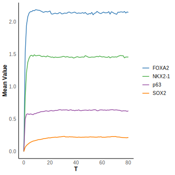

# DelaySSA-dev


RNA velocity is an emerging technique used to analyze single-cell RNA sequencing (scRNA-seq) data. It provides insights into gene expression dynamics and cell state transitions by estimating the instantaneous rate of change of mRNA within individual cells.

The concept of RNA velocity relies on two primary components: newly synthesized, unspliced mRNA ($U$) and mature, spliced mRNA ($S$). The reaction can be represented as
 ```math
\begin{aligned}
&\emptyset \xrightarrow{\alpha(t)} U, \\
&U \xrightarrow{\beta} S,\\
&S \xrightarrow{\gamma} \emptyset.
\end{aligned}
 ```
According to [1-2], we can model transcriptional dynamics using the basic reaction kinetics described by
 ```math
\frac{du(t)}{dt} = \alpha(t) - \beta u(t),
 ```

 ```math
\frac{ds(t)}{dt} = \beta u(t) - \gamma s(t),
 ```
There exits an analytical solution for the equation
 ```math
u(t) = u_0 e^{-\beta \tau} + \frac{\alpha(t)}{\beta} \left(1 - e^{-\beta \tau} \right),
 ```

 ```math
s(t) = s_0 e^{-\gamma \tau} + \frac{\alpha(t)}{\gamma} \left(1 - e^{-\gamma \tau} \right) + \frac{\alpha(t) - \beta u_0}{\gamma - \beta} \left( e^{-\gamma \tau} - e^{-\beta \tau} \right), \tau = t - t_0^{(k)},
 ```

When $\beta=1$, it reduces to
 ```math
u(t) = \alpha (1 - e^{-t}) + u_0 e^{-t}\\
s(t) = \frac{e^{-t(1+\gamma)} \left[ e^{t(1+\gamma)} \alpha (\gamma-1) + e^{t\gamma} \gamma (u_0 - \alpha) \gamma + e^{t} (\alpha - \gamma (s_0 + u_0 - s_0 \gamma)) \right]}{\gamma (\gamma - 1)}
 ```
We can also simulate the velocity model with DelaySSA. Set $\alpha=1$, $\beta=1$, $\gamma=0.2$, $tmax=30s$. Repeat $2\times10^5$ times. After reaching steady state, change $\alpha$ to 0.


Then we consider a network called Four regulatory factors network[3]. The four regulatory factors are $FOXA2(F)$, $NKX2\text{-}1(N)$, $p63(P)$ and $SOX2(S)$. During the reaction, their values affect each other's reaction rate. The reaction can be represented as

```math
\emptyset \xrightarrow{\frac{\alpha_F}{1 + a_1 P^2 + a_2 S^2}} F,
```

```math
\emptyset \xrightarrow{\alpha_N \frac{1 + F^2}{1 + a_3 F^2 + a_4 S^2}} N,
```

```math
\emptyset \xrightarrow{\alpha_P \frac{1 + S^2}{ 1 + a_5 S^2 + a_6 N^2}} P,
```

```math
\emptyset \xrightarrow{\beta_S \frac{S^2}{a_7^2 + S^2} + \frac{\alpha_S}{1 + a_8 F^2 + a_9 N^2}} S,
```
```math
F\xrightarrow{d_F}\emptyset
```
```math
N\xrightarrow{d_N}\emptyset
```

```math
P\xrightarrow{d_P}\emptyset
```
```math
S\xrightarrow{d_S}\emptyset
 ```
We can model transcriptional dynamics using the basic reaction kinetics described by
 ```math
\frac{dF}{dt} = \frac{\alpha_F}{1 + a_1 P^2 + a_2 S^2} - d_F F
 ```

 ```math
\frac{dN}{dt}  = \alpha_N \frac{1 + F^2}{1 + a_3 F^2 + a_4 S^2} - d_N N
 ```

```math
\frac{dP}{dt}  = \alpha_P \frac{1 + S^2}{1 + a_5 S^2 + a_6 N^2} - d_P P
 ```

 ```math
\frac{dS}{dt}  = \beta_S \frac{S^2}{a_7^2 + S^2} + \frac{\alpha_S}{1 + a_8 F^2 + a_9 N^2} - d_S S
 ```
We can simulate the Four regulatory factors network with DelaySSA. 

|Parameters|Values|
| ------------------------------------------------------------------ | ----------------- |
| $\alpha_F$:Basal production rate of FOXA2  | 2.9 |
| $\alpha_N$:Basal production of NKX2-1 | 1 |
| $\alpha_P$:Basal production rate of p63  | 1 |
| $\alpha_S$:Basal production rate of SOX2 | 0.15 |
| $\beta_S$:Self-activation rate | 1.3 |
| $\alpha_1$:Repression strength of FOX2 by p63  | 1 |
| $\alpha_2$:Repression strength of FOX2 by SOX2  | 1 |
| $\alpha_3$:Activation strength of NKX2-1 by FOXA2 | 0.5 |
| $\alpha_4$:Repression strength of NKX2-1 by SOX2  | 2 |
| $\alpha_5$:Activation strength of p63 by SOX2 | 0.2 |
| $\alpha_6$:Repression strength of p63 by NKX2-1  | 1 |
| $\alpha_7$:Threshold constant for the self-activation | 2 |
| $\alpha_8$:Repression strength of p63 by FOX2  | 1.5 |
| $\alpha_9$:Repression strength of p63 by NKX2-1 | 1.5 |
| $d_F$:Degradation rate of FOXA2  | 1 |
| $d_N$:Degradation rate of NKX2-1 | 1 |
| $d_P$:Degradation rate of p63  | 1 |
| $d_S$:Degradation rate of SOX2 | 0.4 |


Besides, the results of setting $\alpha_S$ to 0.15 0.5 1 are shown in the following figures with the `sample_size` = $2\times10^5$.




[1]. Bergen, V., Lange, M., Peidli, S., Wolf, F. A., & Theis, F. J. (2020). Generalizing RNA velocity to transient cell states through dynamical modeling. Nature biotechnology, 38(12), 1408-1414.

[2]. Li, S., Zhang, P., Chen, W., Ye, L., Brannan, K. W., Le, N. T., ... & Wang, G. (2024). A relay velocity model infers cell-dependent RNA velocity. Nature biotechnology, 42(1), 99-108.

[3]. Tang, S., Xue, Y., Qin, Z., Fang, Z., Sun, Y., Yuan, C., ... & Ji, H. (2023). Counteracting lineage-specific transcription factor network finely tunes lung adeno-to-squamous transdifferentiation through remodeling tumor immune microenvironment. National Science Review, 10(4), nwad028.
